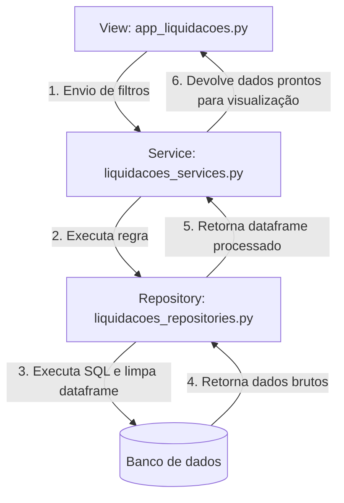

```mermaid
graph TD
    A[View: app_liquidacoes.py] --> |1. Envio de filtros| B[Service: liquidacoes_services.py]
    B --> |2. Executa regra| C[Repository: liquidacoes_repositories.py]
    C --> |3. Executa SQL e limpa dataframe| D[(Banco de dados)]
    D --> |4. Retorna dados brutos| C
    C --> |5. Retorna dataframe processado| B
    B --> |6. Devolve dados prontos para visualização| A
```
